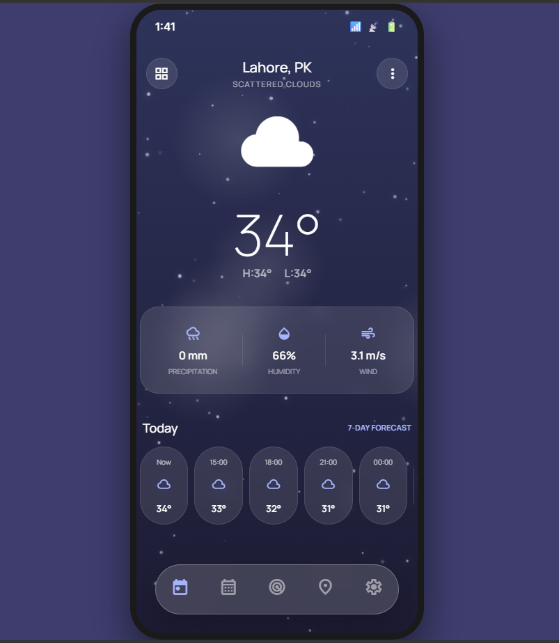
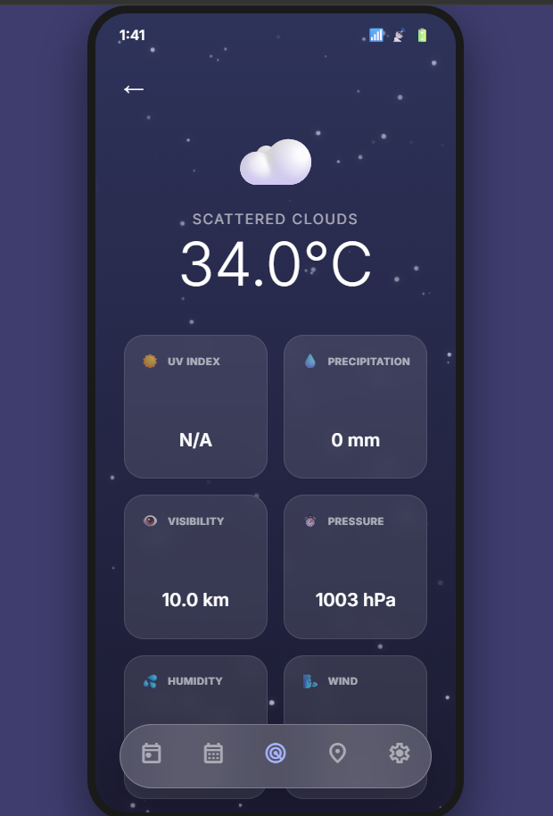
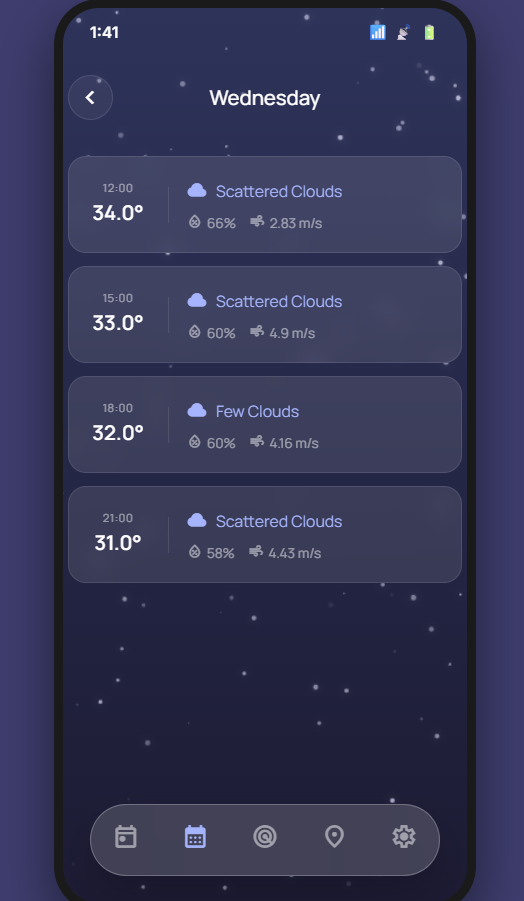
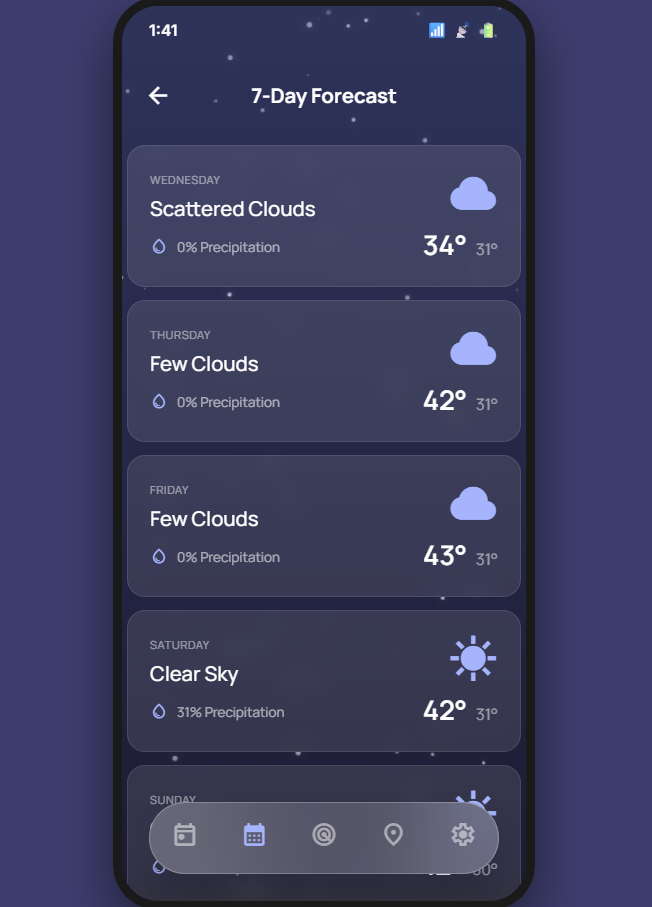
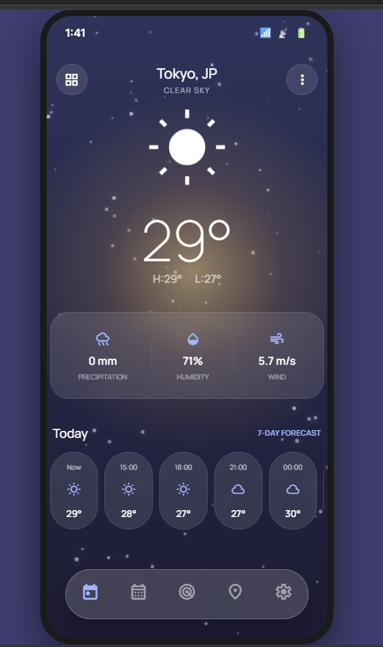
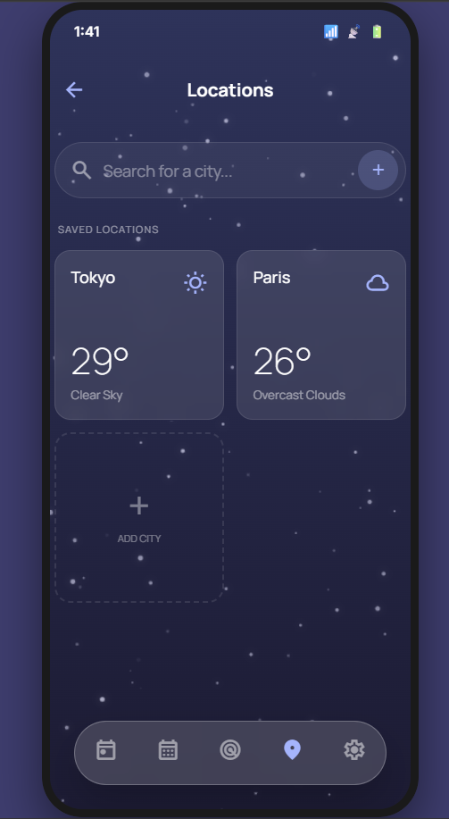
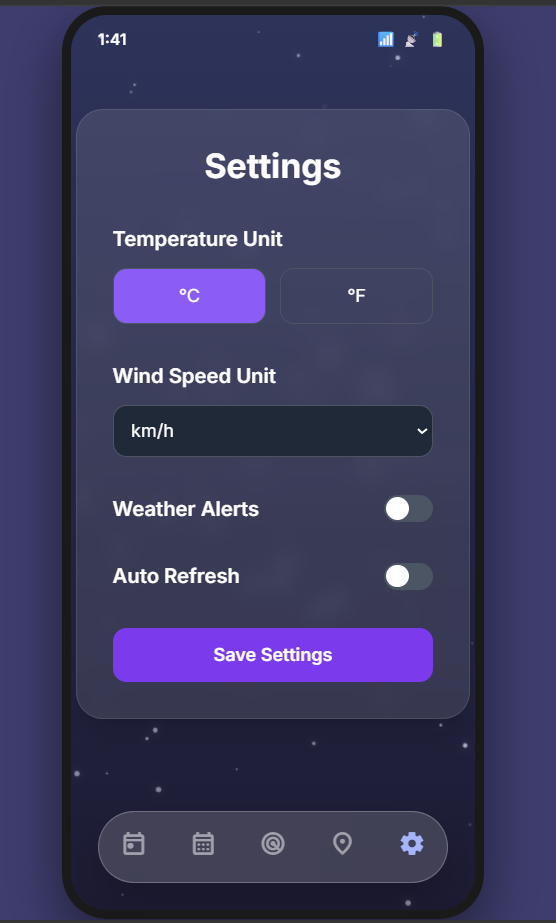

# 🌤️ Weather App

A responsive weather application built with **Python and Flask** that provides real-time weather information using the **OpenWeather API**. The application features a clean, user-friendly interface and is designed to work smoothly across desktop and mobile devices.

## 📸 Screenshots

### 🏠 Home & Weather Details





### 📅 Forecasts







### 📍 Locations & Settings




--

## ✨ Features

* 🌍 Search weather by city
* 🌡️ Display current temperature and weather conditions
* 💧 Humidity information
* 💨 Wind speed information
* ☁️ Weather condition and description
* 📱 Responsive design for desktop and mobile
* ⚡ Real-time weather data through the OpenWeather API
* ❌ User-friendly error handling for invalid locations

## 🛠️ Technologies Used

* **Python**
* **Flask**
* **HTML5**
* **CSS3**
* **JavaScript**
* **OpenWeather API**
* **Jinja2**

## 📂 Project Structure

```text
weather-app/
│
├── app.py
├── requirements.txt
├── .gitignore
│
├── static/
│   └── css/
│       └── style.css
│
└── templates/
    └── index.html
```

## ⚙️ Installation & Setup

### 1. Clone the repository

```bash
git clone https://github.com/AleezahJamil/weather-app.git
cd weather-app
```

### 2. Create a virtual environment

```bash
python -m venv .venv
```

### 3. Activate the virtual environment

**Windows:**

```powershell
.venv\Scripts\activate
```

### 4. Install dependencies

```bash
pip install -r requirements.txt
```

### 5. Configure the API key

Create a `.env` file in the project root:

```env
OPENWEATHER_API_KEY=your_api_key_here
```

Replace `your_api_key_here` with your OpenWeather API key.

> 🔐 The API key is stored in an environment variable and should never be committed to GitHub.

### 6. Run the application

```bash
python app.py
```

Open your browser and visit:

```text
http://127.0.0.1:5000
```

## 🔑 API

This project uses the **OpenWeather API** to retrieve real-time weather data.

You can obtain an API key from the official OpenWeather website.

## 📱 Responsive Design

The application is designed to provide a consistent experience across:

* 💻 Desktop
* 📱 Mobile
* 📟 Tablet

## 🚀 Future Improvements

* Add a multi-day weather forecast
* Add weather icons and animations
* Add location-based weather detection
* Add temperature unit conversion
* Improve accessibility and UI interactions

## 👩‍💻 Author

**Aleezah Jamil**

Built as a practical **Python + Flask** project to strengthen web development, API integration, and backend development skills.

---
